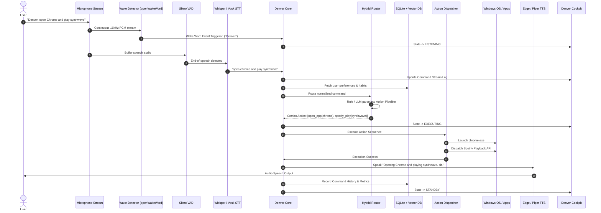

# Denver System Architecture: Windows-First AI Desktop Assistant

> **Product**: Denver AI Assistant (`Denver`)  
> **Design Objective**: Design a modern, robust, production-grade Windows-first AI desktop assistant.  
> Replaces legacy architectural bottlenecks (Tkinter canvas lockups, polling wake loops, flat JSON files, brittle coordinate automation) from the external reference baseline (`Open.Jarvis`) with an asynchronous, event-driven, local-first foundation.

---

## 1. High-Level Architectural Blueprint

```mermaid
graph TB
    subgraph Frontend / Presentation Layer
        UI[Denver Cockpit Desktop Interface<br/>Fluent 2 / Custom Dark Glow Cockpit]
        Systray[System Tray Daemon & Global Hotkeys]
        AudioFX[Audio Reactive HUD Visualizers]
    end

    subgraph Core Orchestration & Event Bus Layer
        Core[Denver Async Runtime Core<br/>asyncio Event Loop]
        Bus[Central Event Bus & Pub/Sub]
        State[Runtime State Machine<br/>Standby | Listening | Thinking | Executing | Speaking]
    end

    subgraph Audio & Voice Pipeline
        AcousticWake[Acoustic Streaming Wake-Word Engine<br/>openWakeWord / ONNX (Planned: Denver)]
        VAD[Voice Activity Detector<br/>Silero VAD]
        STT[Dual STT Engine<br/>Local Whisper / Vosk + Cloud Fallback]
        TTS[Dual TTS Engine<br/>Edge TTS + Piper Offline]
    end

    subgraph Intelligence & Intent Routing
        Router[Hybrid Intent Router]
        LocalRule[Deterministic Regex & Fuzzy Matcher]
        LocalLLM[Local LLM Client<br/>Ollama / Llama.cpp / ONNX GenAI]
        CloudLLM[Cloud Fallback Provider<br/>Groq / Gemini / OpenAI]
    end

    subgraph Action & Automation Engine
        Dispatcher[Action Dispatcher & Safety Guard]
        WinUIA[Windows UI Automation & Accessibility Bridge]
        WinApp[Win32 App Launcher & Process Controller]
        Vision[Screen Capture & Multimodal Analyzer]
    end

    subgraph Storage, Memory & Knowledge
        DB[(Denver SQLite Embedded Database<br/>WAL Mode + Foreign Keys)]
        VectorStore[(Local Vector Store / sqlite-vec<br/>Fast Embedding Similarity)]
        SecVault[Denver Vault Encrypted Credential Storage<br/>Windows DPAPI / Keyring]
    end

    subgraph Plugin & Extension Subsystem
        PluginMgr[Denver Plugin Lifecycle & Permission Manager]
        Sandbox[Isolated Process Runner / Windows Job Objects]
    end

    %% Wiring
    UI <--> Bus
    Systray <--> Bus
    Bus <--> Core
    Core <--> State
    Core <--> AudioFX

    AcousticWake --> Bus
    VAD --> STT
    STT --> Router
    Router --> LocalRule
    Router --> LocalLLM
    Router --> CloudLLM
    LocalRule --> Dispatcher
    LocalLLM --> Dispatcher
    CloudLLM --> Dispatcher

    Dispatcher --> WinUIA
    Dispatcher --> WinApp
    Dispatcher --> Vision
    Dispatcher --> TTS
    Dispatcher --> PluginMgr
    PluginMgr --> Sandbox

    Core <--> DB
    Router <--> VectorStore
    Core <--> SecVault
```

---

## 2. Layer-by-Layer Architectural Breakdown

### 2.1. Presentation Layer (Denver Cockpit & HUD)
- **Decoupled Asynchronous Frontend**: The UI runs independently of runtime logic. State updates and logs flow over thread-safe queues or local IPC (WebSockets / Async Queues).
- **HUD Cyber Cockpit**:
  - Hologram core reactor displaying current Denver assistant posture.
  - Live audio spectrum visualizer (FFT-driven) and waveform canvas.
  - Telemetry bar (CPU, GPU, RAM, VRAM, Ping, Active Provider, Privacy Posture).
  - Terminal stream with color-coded log severities.
- **System Tray & Quick Bar**: Minimized background operation, floating Spotlight-style overlay (`Win + Space` or `Ctrl + Shift + J`).

### 2.2. Audio & Speech Processing Layer
- **Acoustic Streaming Wake-Word**: Employs continuous audio stream sampling with ONNX-based acoustic models (openWakeWord for `"Denver"`) rather than blocking text-transcription loops. Zero cloud latency, minimal CPU overhead (`< 1%`).
- **Voice Activity Detection (VAD)**: Silero VAD detects precise utterance boundaries, eliminating awkward fixed-duration recording windows.
- **Dual STT Engine**:
  - *Local*: Whisper.cpp / Faster-Whisper / Vosk (fully offline).
  - *Cloud*: Fast streaming cloud STT fallback when online and enabled.
- **Dual TTS Engine**:
  - *Online Primary*: Edge TTS (`en-GB-RyanNeural`).
  - *Offline Secondary*: Piper TTS (neural local voices running on ONNX runtime).

### 2.3. Intent Routing & Intelligence Layer
- **Tier 1: Deterministic Rule Matcher (`< 1ms`)**:
  - Exact aliases, normalized regexes, and fuzzy phrase matching for core OS tasks (media, volume, app launch, time, system health).
- **Tier 2: Local LLM Engine (`50 - 300ms`)**:
  - Direct connection to local inference servers (Ollama, LM Studio, or in-process llama-cpp-python).
  - Extracts structured function-calling schemas.
- **Tier 3: Cloud LLM Fallback (Groq / Gemini / OpenAI)**:
  - Invoked for complex reasoning, multi-step actions, general knowledge, and conversational queries.

### 2.4. Desktop Automation & OS Integration Layer
- **Windows UI Automation (UIA) Bridge**:
  - Replaces brittle coordinate clicking (`pyautogui.click(x, y)`) with semantic element targeting via `pywinauto` / `UIAutomation` API (button names, input fields, menu items, window handles).
- **Win32 Process Controller**: Safe application execution, window state queries, virtual desktop management, power state toggles.
- **Screen Intelligence**: Fast native desktop screenshot capture, OCR text extraction (Windows.Media.Ocr / Tesseract), and multimodal vision analysis.

### 2.5. Memory & Persistence Layer
- **Relational Storage (SQLite WAL)**:
  - Strongly typed schemas in `denver_memory.sqlite3` for user preferences, notes, tasks, reminders, audit trails, and command histories.
  - Full ACID compliance and transactional rollbacks.
- **Vector Semantic Search (`sqlite-vec`)**:
  - Stores embeddings of past conversations, notes, and documents.
  - Performs nearest-neighbor cosine similarity queries for context-aware recall.
- **Privacy & Security Vault (Denver Vault)**:
  - Windows DPAPI / `keyring` storage for sensitive API keys.
  - Zero plaintext secrets on disk.

### 2.6. Extensibility & Plugin Layer
- **Manifest Validation & Cryptographic Signatures**: Strict JSON schema validation and Ed25519 asymmetric signature checks.
- **Hardware & OS Isolation**:
  - Windows Job Objects to constrain memory limits (`max_memory_mb`), CPU rate limits, and kill-on-close process guarantees.
  - Strict capability-based permission profiles (`safe`, `normal`, `developer`).

---

## 3. Data Flow Architecture



---

## 4. Key Architectural Comparison: Reference vs Denver

| Aspect | Reference Baseline (`Open.Jarvis`) | Denver Target Architecture |
|---|---|---|
| **Product & Brand** | Open.Jarvis | **Denver AI Assistant (`Denver`)** |
| **Concurrency Model** | Python standard threads with manual sleeps & Tkinter `after()` loops | Full `asyncio` loop with non-blocking async I/O and dedicated worker processes |
| **Wake Detection** | Periodic 3-second speech-to-text transcription polling | Continuous acoustic neural streaming model (zero cloud latency, `< 1%` CPU) |
| **Speech Boundary** | Fixed silence timeout via `speech_recognition` | Dynamic Silero Voice Activity Detection (VAD) |
| **Local LLM** | Configuration flag without working network/client execution | Native Ollama, LM Studio, and in-process ONNX/llama.cpp adapters |
| **Desktop Automation** | Pixel-coordinate clicking & hotkey simulation (`pyautogui`) | Semantic Windows UI Automation (UIA) + Win32 API + fallback coordinates |
| **Data Persistence** | Flat `memory.json` file with manual array slicing | SQLite `denver_memory.sqlite3` with WAL mode, foreign keys, and vector semantic search |
| **Plugin Isolation** | Mock temp directory (`PYTHONNOUSERSITE=1`) | Windows Job Objects, process sandboxing, and Ed25519 signature verification |
| **Security & Secrets** | Plaintext `.env` file | Windows Data Protection API (DPAPI) + encrypted credential vault |
| **UI Framework** | Tkinter / CustomTkinter with custom canvas math | Decoupled Denver Cockpit with asynchronous state bridge and responsive hardware acceleration |
