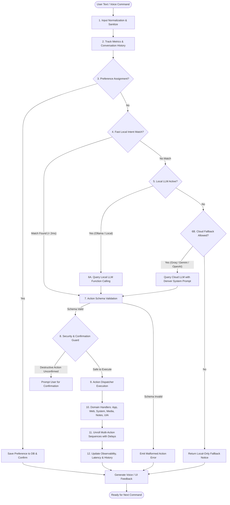

# Denver Command Processing Pipeline Specification

> **Product**: Denver AI Assistant (`Denver`)  
> **Scope**: Detailed end-to-end specification of how user intent is normalized, categorized, routed, validated, executed, and audited across Denver.

---

## 1. High-Level Flowchart



---

## 2. Pipeline Stages

### Stage 1: Input Normalization & Cleansing
- **Whitespace & Accents**: Trims leading/trailing whitespace, converts NFKD unicode into standard ASCII, and collapses redundant spaces.
- **Punctuation Stripping**: Cleans surrounding punctuation while preserving URLs, path separators (`\`, `/`), and hotkey separators (`+`).
- **Lowercasing**: Uniform lowercase representation for fast dictionary lookups.

### Stage 2: Telemetry & Memory Buffer
- Appends the raw user utterance to the session's conversational memory buffer.
- Increments the command habit frequency index in the persistence store (`denver_memory.sqlite3`).

### Stage 3: Preference Sniffing
- Analyzes commands against conversational preference patterns:
  - `"remember that my favorite music is [X]"`
  - `"set default browser to [X]"`
  - `"my preferred editor is [X]"`
- If detected, extracts the entity, updates the database, and short-circuits the pipeline with a confirmation response (`"I have updated your preferences, sir."`).

### Stage 4: Deterministic Local Intent Matcher (Tier 1)
- Evaluates normalized input against high-confidence patterns in `< 2ms`:
  - **System Telemetry**: `time`, `date`, `battery`, `cpu`, `ram`, `gpu`, `disk`.
  - **App Launching**: `open chrome`, `launch vs code`, `start spotify`.
  - **Web Navigation**: `open youtube`, `go to github.com`, `google search [query]`.
  - **Window Controls**: `minimize all`, `maximize window`, `close window`, `show desktop`.
  - **Media Controls**: `play music`, `pause`, `next song`, `volume up`, `mute`.
  - **Desktop Utility**: `take screenshot`, `read clipboard`, `summarize clipboard`.
  - **Notes & Habits**: `read notes`, `add note [text]`, `show my habits`.

### Stage 5: Intelligence & LLM Routing (Tiers 2 & 3)
- When no local rule matches:
  - **Tier 2 (Local LLM)**: Connects to local OpenAI-compatible endpoint (Ollama `http://localhost:11434/v1` or LM Studio).
  - **Tier 3 (Cloud LLM)**: Connects to high-speed cloud providers (Groq `llama-3.1-8b-instant`, Gemini 1.5 Flash, or OpenAI GPT-4o-mini).
- System Prompt instructs the model to act as Denver's structured function-calling parser, returning **strictly valid JSON**.

---

## 3. Action Schema Format

The pipeline standardizes all execution on a structured JSON contract.

### Single Action Format
```json
{
  "action": "open_app",
  "params": {
    "app": "vscode"
  },
  "response": "Opening Visual Studio Code, sir."
}
```

### Multi-Action Composite Format
```json
{
  "actions": [
    {
      "action": "open_app",
      "params": { "app": "chrome" }
    },
    {
      "action": "open_web",
      "params": { "url": "https://youtube.com" }
    },
    {
      "action": "press_key",
      "params": { "key": "volumeup" }
    }
  ],
  "response": "Opening Chrome, navigating to YouTube, and adjusting the volume, sir."
}
```

---

## 4. Supported Action Catalog

| Action Identifier | Parameters | Description |
|---|---|---|
| `open_app` | `{"app": string}` | Launches a desktop application by name or path |
| `open_web` | `{"url": string}` | Opens a sanitized URL in the default web browser |
| `search_google` | `{"query": string}` | Performs an encoded Google search |
| `get_time` | `{}` | Speaks and displays the current system time |
| `get_date` | `{}` | Speaks and displays the current calendar date |
| `get_battery` | `{}` | Queries battery percentage and charging status |
| `get_cpu` | `{}` | Measures live CPU utilization percentage |
| `get_ram` | `{}` | Measures live memory utilization and available GB |
| `screenshot` | `{}` | Captures desktop screenshot and saves to Pictures |
| `read_clipboard` | `{}` | Reads copied text aloud with sensitive data masking |
| `summarize_clipboard` | `{}` | Summarizes clipboard content locally or via LLM |
| `type_text` | `{"text": string}` | Simulates keyboard typing into active window |
| `press_key` | `{"key": string}` | Presses hotkey (e.g. `ctrl+c`, `alt+f4`, `win+d`) |
| `mouse_click` | `{"x": int, "y": int, "button": "left"\|"right"\|"double"}` | Clicks specified screen coordinate |
| `scroll` | `{"direction": "up"\|"down", "amount": int}` | Scrolls mouse wheel |
| `minimize_all` | `{}` | Shows desktop / minimizes all windows (`Win+D`) |
| `maximize_window` | `{}` | Maximizes current active window (`Win+Up`) |
| `close_window` | `{}` | Closes active window (`Alt+F4`) |
| `lock_screen` | `{}` | Locks Windows workstation |
| `sleep` | `{}` | Enters Windows sleep state |
| `shutdown` | `{}` | Initiates system shutdown (Guarded) |
| `restart` | `{}` | Initiates system restart (Guarded) |
| `spotify_play` | `{}` | Resumes Spotify playback |
| `spotify_pause` | `{}` | Pauses Spotify playback |
| `spotify_next` | `{}` | Skips to next Spotify track |
| `spotify_prev` | `{}` | Returns to previous Spotify track |
| `spotify_volume` | `{"level": int}` | Sets Spotify volume (0 - 100) |
| `spotify_search` | `{"query": string}` | Searches and plays track on Spotify |
| `add_note` | `{"text": string}` | Stores a new timestamped note |
| `read_notes` | `{}` | Lists or reads recent notes |
| `talk` | `{}` | Pure conversational response without OS action |

---

## 5. Security & Safety Gates

1. **Destructive Action Gate**:
   - Actions in `{"shutdown", "restart"}` trigger a confirmation modal in the Denver Cockpit.
   - If not confirmed within 10 seconds or explicitly canceled, execution aborts.
2. **Path Sanitization**:
   - Target files must resolve to valid user paths. Relative directory traversal (`../`) is rejected.
3. **URL Scheme Whitelist**:
   - Only `http://` and `https://` are permitted. Executable schemes (`file://`, `ms-settings:`) are blocked unless explicitly allowlisted.
4. **Command Tokenization**:
   - Subprocesses are spawned as arrays (`[executable, arg1, arg2]`). Raw shell strings (`shell=True`) are strictly forbidden.

---

## 6. Execution & Feedback Loop

- **State Updates**: Emits granular progress states (`PROCESSING` -> `EXECUTING` -> `SPEAKING` -> `STANDBY`).
- **Timing & Latency Metrics**: Measures latency per stage:
  - `t_route`: Time to classify intent.
  - `t_dispatch`: Time to complete OS automation.
  - `t_tts`: Time to first synthesized audio byte.
- **Audit Logging**: Structured JSON records stored in SQLite audit table (`denver_memory.sqlite3`) for historical review and debugging.
