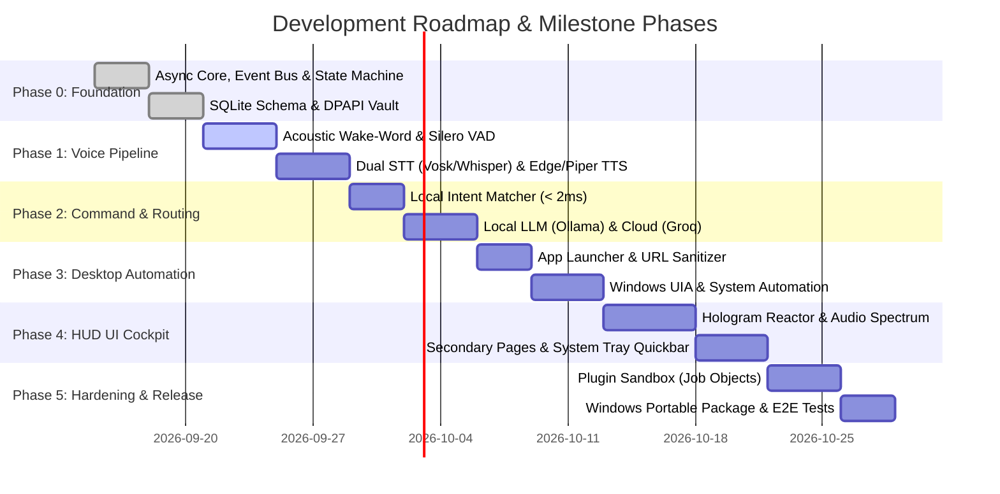

# Denver Implementation Plan & Engineering Roadmap

> **Product**: Denver AI Assistant (`Denver`)  
> **Objective**: Step-by-step engineering implementation plan to build an independent, production-grade, Windows-first AI desktop assistant.

---

## 1. Recommended Technology Stack

| Layer | Recommended Technology | Rationale |
|---|---|---|
| **Core Runtime** | Python 3.11+ / `asyncio` | High productivity, rich AI ecosystem, native async event loops |
| **GUI Framework** | `customtkinter` + Modern Canvas / PySide6 | Dark glassmorphism, hardware-accelerated animations, zero web-bloat |
| **Acoustic Wake-Word** | `openWakeWord` (ONNX) | Local streaming acoustic model for `"Denver"`, `< 1%` CPU, `< 100ms` latency |
| **Voice Activity Detection**| `Silero VAD` (ONNX) | Deep learning speech boundary detection, eliminates fixed wait timeouts |
| **Speech-to-Text (STT)** | `Faster-Whisper` / `Vosk` + Groq Cloud | Instant offline local fallback + ultra-fast cloud transcription |
| **Text-to-Speech (TTS)** | `edge-tts` + `Piper TTS` (ONNX) | Free neural British voice (`en-GB-RyanNeural`) + 100% offline neural voice |
| **Database & Memory** | `SQLite` (WAL mode) + `sqlite-vec` | Zero-config embedded relational store (`denver_memory.sqlite3`) with vector search |
| **Desktop Automation** | `pywinauto` (UIA) + `psutil` + `pyautogui` | Semantic Windows UI Automation + fallback coordinates |
| **Security & Secrets** | Windows `DPAPI` / `keyring` (Denver Vault) | Zero plaintext secrets on disk; encrypted per-user storage |
| **Packaging & Release** | `PyInstaller` + Inno Setup | Clean portable `.zip` and one-click `Denver.exe` installer |

---

## 2. Phased Implementation Roadmap

---

## 3. Phase-by-Phase Deliverables & Verification

### Phase 0: Foundation & Core Subsystems
- **Deliverables**:
  - `src/denver/core/event_bus.py`: Async Pub/Sub event dispatcher.
  - `src/denver/core/state_machine.py`: Strictly typed Assistant State Machine.
  - `src/denver/memory/db.py`: SQLite initialization with WAL mode (`denver_memory.sqlite3`).
  - `src/denver/security/vault.py`: Windows DPAPI secret manager.
- **Verification**:
  - Run unit tests verifying DB transactions, concurrent reads, and DPAPI key encryption/decryption.

### Phase 1: Voice & Audio Pipeline
- **Deliverables**:
  - `src/denver/audio/capture.py`: WASAPI 16kHz audio stream buffer.
  - `src/denver/audio/wake.py`: openWakeWord ONNX acoustic streaming detector.
  - `src/denver/audio/vad.py`: Silero VAD speech boundary segmenter.
  - `src/denver/audio/stt.py`: Unified STT selector (Faster-Whisper / Vosk / Groq).
  - `src/denver/audio/tts.py`: Async streaming Edge-TTS + Piper local engine.
- **Verification**:
  - Voice test scripts verifying wake detection in `< 100ms` and TTS playback under 400ms latency.

### Phase 2: Command Processing & Intelligence Routing
- **Deliverables**:
  - `src/denver/commands/normalizer.py`: Text sanitization and ASCII cleaner.
  - `src/denver/commands/router.py`: High-speed regex and fuzzy intent matcher.
  - `src/denver/providers/router.py`: Local LLM (Ollama) + Cloud LLM (Groq / Gemini) router.
  - `src/denver/commands/dispatcher.py`: Action validation and sequential execution unroller.
- **Verification**:
  - Automated benchmark test suite evaluating intent classification accuracy across 100+ prompt fixtures.

### Phase 3: Desktop Automation & OS Integration
- **Deliverables**:
  - `src/denver/automation/apps.py`: Dynamic Windows Start Menu and Registry app indexer.
  - `src/denver/automation/browser.py`: URL sanitizer and default browser controller.
  - `src/denver/automation/uia.py`: Windows UI Automation element targeting engine.
  - `src/denver/automation/desktop.py`: Power, volume, window, and screenshot actions.
- **Verification**:
  - Test suite asserting safe subprocess execution, blocked dangerous commands, and valid screenshot outputs.

### Phase 4: HUD Cyber Interface (Denver Cockpit) & Spotlight Bar
- **Deliverables**:
  - `src/denver/ui/app.py`: Main CustomTkinter cockpit window.
  - `src/denver/ui/reactor.py`: Canvas Arc Reactor hologram visualizer.
  - `src/denver/ui/visualizers.py`: Real-time FFT equalizer and audio waveform.
  - `src/denver/ui/pages/`: System Monitor, Modules, Integrations, Security, Settings.
  - `src/denver/ui/spotlight.py`: Floating global shortcut search bar (`Ctrl+Shift+J`).
- **Verification**:
  - UI smoke test verifying zero frame-drop animation and responsive state transitions.

### Phase 5: Plugin Subsystem, Security & Release Packaging
- **Deliverables**:
  - `src/denver/plugins/sandbox.py`: Windows Job Object subprocess sandbox.
  - `src/denver/plugins/verifier.py`: Ed25519 signature validator.
  - `scripts/build_release.py`: PyInstaller portable package generator for `Denver.exe`.
  - `src/denver/health/diagnostics.py`: Pre-flight system check and self-repair engine.
- **Verification**:
  - Execute full test matrix (`pytest tests/`), build portable package, and verify standalone executable run on a clean Windows environment.

---

## 4. Major Technical Risks & Mitigation Strategies

| Risk | Impact | Mitigation Strategy |
|---|---|---|
| **Audio Loop UI Freezes** | Critical | Segregate audio capture, speech synthesis, and heavy LLM queries into dedicated background `asyncio` tasks and multiprocessing workers. UI thread strictly handles rendering. |
| **High False Wake-Word Triggers** | High | Use trained acoustic neural models (openWakeWord) with tunable threshold sliders and dynamic ambient noise floor calibration. |
| **Cloud API Rate Limits / Outages** | High | Local-first design: All core desktop commands, local Ollama LLMs, and offline Vosk/Whisper STT function without cloud connectivity. |
| **Malicious Community Plugins** | Critical | Enforce strict capability manifests, Windows Job Object memory/CPU limits, and Ed25519 signature verification before execution. |
| **Brittle Coordinate Automation** | Medium | Prioritize semantic Windows UI Automation (UIA) and Win32 APIs over hardcoded pixel coordinates. |
