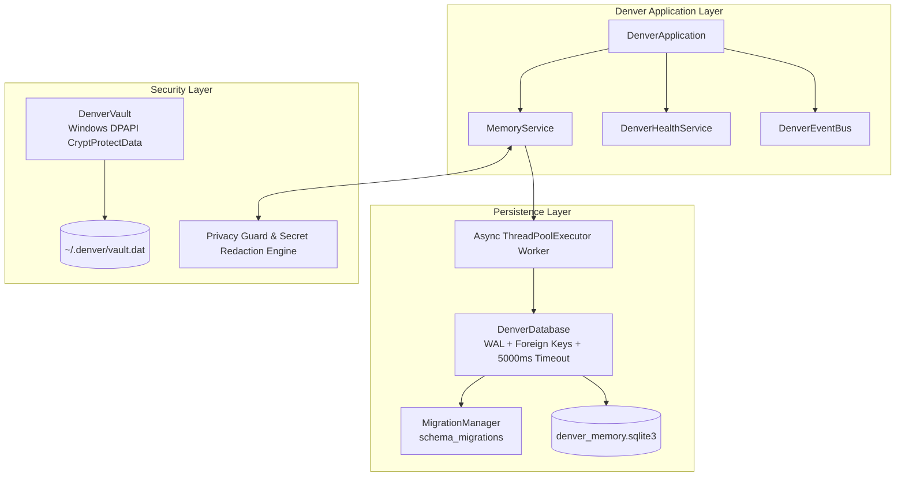

# Denver Phase 1 Implementation Report

> **Product**: Denver AI Assistant (`Denver`)  
> **Phase**: Phase 1 — Denver Memory & Denver Vault  
> **Status**: Complete & Verified (49/49 Tests Passing)  
> **Target OS**: Windows 10/11 (Native Windows DPAPI + Embedded SQLite WAL)

---

## 1. Executive Summary

Phase 1 establishes the persistent memory architecture and secure Windows credential storage for **Denver AI Assistant**. It replaces legacy flat JSON storage patterns with an embedded, ACID-compliant SQLite relational memory engine running in Write-Ahead Logging (WAL) mode, coupled with a native Windows Data Protection API (DPAPI) vault for zero-plaintext secret management.



---

## 2. SQLite Database Architecture

- **Database File**: Configurable via `DENVER_DATABASE_PATH` (defaults to `denver_memory.sqlite3`).
- **Pragmas Configured**:
  - `PRAGMA journal_mode = WAL;` (Concurrent readers without blocking writers)
  - `PRAGMA synchronous = NORMAL;` (Optimal durability with reduced sync overhead)
  - `PRAGMA foreign_keys = ON;` (Referential integrity enforcement)
  - `PRAGMA busy_timeout = 5000;` (5-second lock timeout for busy handlers)
- **Asynchronous Execution Model**:
  - Python's standard `sqlite3` driver is synchronous. Denver encapsulates all queries and transactions inside `DenverDatabase.run_async()`, executing on a dedicated background worker thread pool (`ThreadPoolExecutor(max_workers=1)`).
  - Main `asyncio` event loop is never blocked by disk I/O.

---

## 3. Database Schema & Migration Strategy

The database schema is managed idempotently via `MigrationManager` backed by a `schema_migrations` tracking table.

### Tables Implemented

| Table Name | Primary Key | Indexes | Purpose |
|---|---|---|---|
| `schema_migrations` | `version INTEGER` | None | Tracks applied migration versions and timestamps. |
| `user_preferences` | `key TEXT` | `idx_preferences_category` | Stores key-value user preferences with categorizations. |
| `notes` | `id INTEGER AUTOINCREMENT` | `idx_notes_pinned` | User notes, persistent reminders, and tags. |
| `tasks` | `id INTEGER AUTOINCREMENT` | `idx_tasks_due_completed` | Scheduled tasks, due timestamps, and completion statuses. |
| `command_habits` | `command_phrase TEXT` | None | Frequency counters and time-series for learned user habits. |
| `command_audit_log` | `id INTEGER AUTOINCREMENT` | `idx_audit_created_at` | Structured execution audit trail with latency and routing records. |
| `memory_items` | `id INTEGER AUTOINCREMENT` | `idx_memory_category`, `idx_memory_privacy`, `uq_memory_category_key` | Unified key-value and categorized memory items with privacy classification. |
| `memory_embeddings` | `id INTEGER AUTOINCREMENT` | None | Table prepared for vector recall embeddings in subsequent phases. |

---

## 4. Denver Memory Service API

The `MemoryService` provides a unified interface orchestrating:
1. **Tier 1 (Ephemeral Short-Term Buffer)**: An in-memory ring buffer (`deque(maxlen=20)`) retaining active multi-turn conversation context across session turns.
2. **Tier 2 (Relational Persistent Store)**: Structured SQLite persistence for user profiles, notes, preferences, tasks, habits, and audits.
3. **Context Synthesizer**: `get_context_summary()` produces compact, token-bounded prompt contexts combining preferences, pinned notes, top habits, and recent conversation turns.

### Supported Operations
- `create_memory(category, key, content, privacy_level, metadata)`
- `get_memory(category, key)`
- `update_memory(category, key, content, privacy_level, metadata)`
- `delete_memory(category, key)`
- `list_memories(category, limit, offset)`
- `search_memories(query, category, limit)`
- `clear_memories(category)`
- `set_preference(key, value, category)` / `get_preference(key)` / `list_preferences(category)`
- `create_note(title, content, tags, is_pinned)` / `list_notes(limit)` / `search_notes(query)`
- `create_task(task_text, due_at)` / `list_tasks(include_completed)` / `complete_task(task_id)`
- `record_habit(command_phrase)` / `list_habits(limit)`
- `log_audit(raw_command, routed_action, provider_used, status, latency_ms)` / `list_audit_logs(limit)`
- `add_conversation_turn(role, content)` / `get_recent_conversation(limit)` / `clear_short_term_buffer()`

---

## 5. Privacy Controls & Secret Redaction

Denver enforces strict data privacy controls:
1. **Zero-Persistence Privacy Mode (`DENVER_PRIVACY_MODE=true` or dynamic `set_privacy_mode(True)`)**:
   - Skips all disk writes to SQLite.
   - All memory items and preferences remain in RAM only or return ephemeral mock instances without persisting.
2. **Pre-Storage Secret Redaction**:
   - `_sanitize_text()` runs regex filters intercepting API keys, auth tokens, passwords, and bearer tokens, masking them (`api_key=***`, `Bearer ***`) prior to SQLite insertion or event publishing.
3. **Selective & Bulk Erasure**:
   - Individual memory deletion by key or ID.
   - Full memory purge via `clear_memories()`, `clear_notes()`, `clear_tasks()`, and `clear_all_secrets()`.

---

## 6. Denver Vault (Windows DPAPI Credential Storage)

- **Module**: `src/denver/security/vault.py`
- **Native Implementation**: Backed by `ctypes.windll.crypt32.CryptProtectData` and `CryptUnprotectData` with `CRYPTPROTECT_UI_FORBIDDEN` flag.
- **Key Features**:
  - Bound directly to the active Windows user login session; credentials cannot be extracted by unauthorized local accounts or copied to external machines.
  - Zero plaintext stored on disk: `vault.dat` holds only JSON mappings of base64-encoded binary DPAPI ciphertexts.
  - Non-Windows test fallback supports base64 encoding for cross-platform test pipelines.
- **Vault API**:
  - `set_secret(name, value)`
  - `get_secret(name)`
  - `delete_secret(name)`
  - `has_secret(name)`
  - `list_secret_names()`
  - `clear_all_secrets()`

---

## 7. Event Bus Integration

The memory subsystem publishes typed events to `DenverEventBus`:
- `MemoryCreated`: Published upon successful item creation/update with sanitized category/key/privacy level.
- `MemoryRetrieved`: Published upon memory query.
- `MemoryUpdated`: Published upon item updates.
- `MemoryDeleted`: Published when items are removed.
- `MemoryCleared`: Published when memory stores are cleared.

---

## 8. Health Service & Diagnostics Integration

`DenverHealthService` directly probes `DenverDatabase`:
- Reports real subsystem status: `READY`, `DEGRADED`, `ERROR`, or `NOT_CONFIGURED`.
- Structured health report provides diagnostic metadata without leaking user contents:
  ```json
  "database": {
    "status": "READY",
    "database_path": "denver_memory.sqlite3",
    "connected": true,
    "sqlite_version": "3.50.4",
    "journal_mode": "wal",
    "schema_version": 1,
    "integrity": "ok"
  }
  ```

---

## 9. Verification & Test Matrix

All 49 unit and integration tests are passing (100% green).

| Test Module | Tests | Focus Area | Status |
|---|---|---|---|
| `tests/unit/test_vault.py` | 8 | DPAPI encryption/decryption, overwrite, delete, secret names listing, zero plaintext on disk | PASS |
| `tests/unit/test_database.py` | 5 | SQLite initialization, WAL mode, foreign keys, migrations, typed repositories, health probe | PASS |
| `tests/unit/test_memory_service.py` | 5 | Memory CRUD, search, ephemeral buffer, context synthesis, event bus publishing | PASS |
| `tests/unit/test_privacy_controls.py` | 3 | Privacy mode zero-persistence, pre-save token redaction, ephemeral redaction | PASS |
| `tests/unit/test_security_audit.py` | 4 | Verification that secrets are not logged, stored in SQLite, exported in config, or leaked in health | PASS |
| `tests/unit/test_event_bus.py` | 7 | Pub/sub routing, failure isolation, wildcard dispatch, async execution | PASS |
| `tests/unit/test_state_machine.py` | 8 | State transitions, invalid transition guard, hook callbacks | PASS |
| `tests/unit/test_logging.py` | 3 | Secret masking filter, rotating file handler | PASS |
| `tests/unit/test_settings.py` | 4 | Config parsing, defaults, sanitized dictionary export | PASS |
| `tests/unit/test_health_service.py` | 4 | Telemetry, state degrade, subsystem statuses, attached database reporting | PASS |
| `tests/integration/test_application_lifecycle.py` | 4 | Full lifecycle (BOOTING -> STANDBY -> STOPPED), CLI flags (`--version`, `--health`, `--check-config`) | PASS |
| **Total** | **49** | | **100% Passing** |

---

## 10. Known Limitations & Phase 2 Readiness

1. **Vector Search (`sqlite-vec`)**: The schema includes `memory_embeddings`, but vector indexing will be hooked up when local ONNX embeddings are introduced in future phases.
2. **Provider Keyless Mode**: Denver continues to operate in keyless mode without requiring any API keys; provider credential resolution from `DenverVault` is ready for Phase 2/3.
