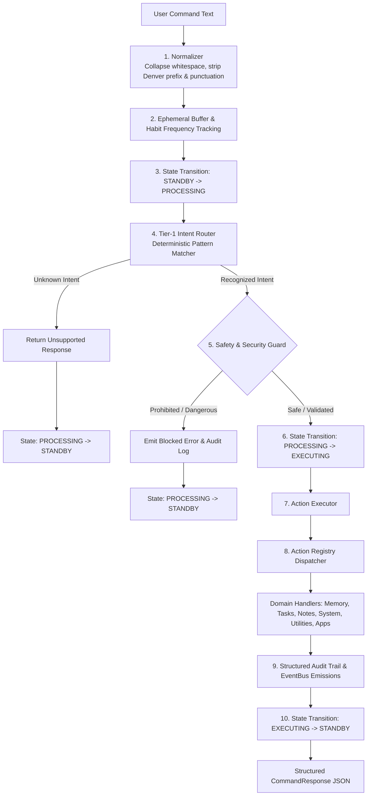

# Denver Phase 2 Implementation Report

> **Product**: Denver AI Assistant (`Denver`)  
> **Phase**: Phase 2 — Denver Command Engine  
> **Status**: Complete & Verified (79/79 Tests Passing)  
> **Interface**: Text Command Pipeline (Zero Audio / Zero LLM / Zero Arbitrary Shell Execution)

---

## 1. Executive Summary

Phase 2 builds the deterministic, secure, and extensible **Command Processing Engine** for **Denver AI Assistant**. It transforms raw text inputs into normalized utterances, identifies user intent using local rules in `< 2ms`, validates safety contracts, routes to registered handlers, executes stateful actions against `MemoryService`, and returns structured responses while maintaining authoritative runtime state transitions.



---

## 2. Command Architecture & Pipeline

### Modules in `src/denver/commands/`

| Module | Responsibility |
|---|---|
| [`models.py`](file:///c:/Users/diwak/Desktop/AI/src/denver/commands/models.py) | Strongly-typed domain models (`CommandRequest`, `CommandIntent`, `ActionRequest`, `ActionResult`, `CommandResponse`, `CommandContext`, `CommandRiskLevel`, `CommandCategory`). |
| [`normalizer.py`](file:///c:/Users/diwak/Desktop/AI/src/denver/commands/normalizer.py) | Canonical text normalization, Unicode NFKD conversion, whitespace collapsing, assistant prefix stripping (`"Denver, "`, `"hey denver"`, etc.), and surrounding punctuation trimming. |
| [`safety.py`](file:///c:/Users/diwak/Desktop/AI/src/denver/commands/safety.py) | Pre-execution safety validator intercepting dangerous shell flags (`cmd.exe /c`, `powershell -enc`, `bash -c`), destructive binaries (`format`, `del /f`, `diskpart`), code injection (`eval`, `exec`), directory traversals (`../`), and invalid URL protocols. |
| [`registry.py`](file:///c:/Users/diwak/Desktop/AI/src/denver/commands/registry.py) | Extensible catalog of registered action definitions with parameter schemas, risk classifications, and async/sync handler mappings. |
| [`router.py`](file:///c:/Users/diwak/Desktop/AI/src/denver/commands/router.py) | High-speed Tier-1 deterministic regex/pattern matcher classifying utterances into typed `CommandIntent` structures in `< 2ms` without requiring any cloud or local LLM. |
| [`executor.py`](file:///c:/Users/diwak/Desktop/AI/src/denver/commands/executor.py) | Execution boundary executing registered handlers in isolation, measuring latency (`latency_ms`), and capturing exceptions cleanly. |
| [`service.py`](file:///c:/Users/diwak/Desktop/AI/src/denver/commands/service.py) | Central `CommandEngineService` facade orchestrating the complete pipeline lifecycle, state machine transitions, event emissions, and audit trail logging. |
| [`__init__.py`](file:///c:/Users/diwak/Desktop/AI/src/denver/commands/__init__.py) | Package exports. |

---

## 3. Supported Built-In Actions

The Phase 2 engine registers and supports the following deterministic actions:

| Action Name | Category | Risk Level | Description | Example Queries |
|---|---|---|---|---|
| `get_time` | `UTILITY` | `SAFE` | System clock query | `"what time is it"`, `"current time"`, `"tell me the time"` |
| `get_date` | `UTILITY` | `SAFE` | Calendar date query | `"today's date"`, `"what date is it"`, `"current date"` |
| `get_system_status` | `SYSTEM` | `SAFE` | Runtime & subsystem health report | `"system status"`, `"system health"`, `"how are you"` |
| `get_cpu` | `SYSTEM` | `SAFE` | Live CPU utilization | `"cpu usage"`, `"get cpu"`, `"cpu percent"` |
| `get_ram` | `SYSTEM` | `SAFE` | Memory utilization & available GB | `"memory usage"`, `"ram usage"`, `"get ram"` |
| `get_battery` | `SYSTEM` | `SAFE` | Battery percentage & power status | `"battery status"`, `"battery level"`, `"get battery"` |
| `open_application` | `APPLICATION` | `LOW` | Validates & returns execution-ready app launch intent | `"open chrome"`, `"launch vs code"`, `"start notepad"` |
| `close_application` | `APPLICATION` | `MEDIUM` | Validates & returns execution-ready app close intent | `"close notepad"`, `"quit chrome"`, `"kill process"` |
| `create_note` | `NOTE` | `LOW` | Persists user note in SQLite store | `"create note Meeting: discuss roadmap"`, `"add note buy groceries"` |
| `list_notes` | `NOTE` | `SAFE` | Lists recent stored notes | `"show notes"`, `"list notes"`, `"my notes"` |
| `search_notes` | `NOTE` | `SAFE` | Searches stored notes by keyword | `"search notes for roadmap"`, `"find note python"` |
| `create_task` | `TASK` | `LOW` | Creates scheduled task item | `"create task study DBMS"`, `"remind me to call John"` |
| `list_tasks` | `TASK` | `SAFE` | Lists pending active tasks | `"list tasks"`, `"show tasks"`, `"my tasks"` |
| `complete_task` | `TASK` | `MEDIUM` | Marks task ID as completed | `"complete task 3"`, `"mark task 1 as done"` |
| `remember` | `MEMORY` | `LOW` | Stores persistent fact in SQLite | `"remember that server port is 8080"`, `"remember my name is Alex"` |
| `recall_memory` | `MEMORY` | `SAFE` | Searches stored facts by keyword | `"what do you remember about server port"`, `"recall Alex"` |
| `forget_memory` | `MEMORY` | `MEDIUM` | Clears stored memory matching query | `"forget server port"`, `"delete memory Alex"` |
| `set_preference` | `MEMORY` | `LOW` | Sets user profile preference | `"my favorite music is synthwave"`, `"set preference editor to vscode"` |
| `get_preference` | `MEMORY` | `SAFE` | Queries user profile preference | `"what is my favorite music"`, `"get preference editor"` |

---

## 4. Safety Model & Defense Layers

1. **Strict Non-Code Evaluation**: User commands are strictly treated as data payloads, never evaluated via `eval()`, `exec()`, or `os.system()`.
2. **Dangerous Shell Blacklisting**: Blocks `cmd.exe /c`, `powershell.exe -enc`, `bash -c`, `format`, `del /f`, `diskpart`, `vssadmin`, `rm -rf`.
3. **URL Protocol Allowlisting**: Rejects any URL scheme other than `http://` and `https://`.
4. **Path Traversal Protection**: Rejects paths containing directory traversal tokens (`../`, `..\`).
5. **Confirmation Guard**: Actions with `requires_confirmation = True` (e.g. `shutdown`, `restart`) are blocked unless `DENVER_ALLOW_DESTRUCTIVE_ACTIONS` is explicitly enabled.

---

## 5. State Machine & Event Bus Integration

### State Machine Lifecycle
- Command processing transitions cleanly:
  - Standard execution: `STANDBY -> PROCESSING -> EXECUTING -> STANDBY`
  - Unrecognized / Blocked: `STANDBY -> PROCESSING -> STANDBY`
- Illegal transitions are intercepted and guarded by `DenverStateMachine`.

### EventBus Emissions
- `CommandReceived`: Emitted when raw command arrives (`command_text`, `source`).
- `CommandNormalized`: Emitted with clean canonical text (`raw_text`, `normalized_text`).
- `CommandRouted`: Emitted with resolved intent classification (`intent_name`, `action_name`, `category`, `confidence`, `risk_level`).
- `CommandExecutionStarted`: Emitted when action handler begins (`action_name`, `risk_level`).
- `CommandExecutionCompleted`: Emitted upon successful execution (`action_name`, `success`, `latency_ms`).
- `CommandFailed`: Emitted when command routing, safety, or execution fails (`action_name`, `reason`, `error`).

---

## 6. CLI Integration

Users and automation scripts can execute single text commands via:
```bash
python -m denver --command "Denver, what time is it?"
```
Outputs structured, machine-readable JSON:
```json
{
  "success": true,
  "message": "The current time is 12:18 PM.",
  "action": "get_time",
  "data": {
    "time": "12:18 PM",
    "hour": 12,
    "minute": 18
  },
  "risk": "SAFE",
  "confidence": 1.0,
  "latency_ms": 53.89,
  "error": null
}
```

---

## 7. Verification & Test Matrix

All 79 unit and integration tests across Phase 0, Phase 1, and Phase 2 are passing (100% green).

| Test Module | Tests | Focus Area | Status |
|---|---|---|---|
| `tests/unit/test_command_normalizer.py` | 4 | Whitespace, NFKD unicode, prefix stripping, punctuation preservation | PASS |
| `tests/unit/test_command_router.py` | 7 | Intent classification, parameter extraction, unknown intent fallback | PASS |
| `tests/unit/test_action_registry.py` | 4 | Action registration, duplicate protection, lookup, enabling/disabling | PASS |
| `tests/unit/test_safety_validator.py` | 6 | Shell injection blocking, directory traversal, URL schemes, confirmation | PASS |
| `tests/unit/test_command_engine.py` | 8 | End-to-end command execution, memory/task/note integration, state transitions, events | PASS |
| `tests/unit/test_vault.py` | 8 | Windows DPAPI encryption/decryption, secret keys, disk cipher check | PASS |
| `tests/unit/test_database.py` | 5 | SQLite WAL mode, pragmas, schema migrations, repositories | PASS |
| `tests/unit/test_memory_service.py` | 5 | Memory CRUD, search, ephemeral buffer, context synthesis | PASS |
| `tests/unit/test_privacy_controls.py` | 3 | Zero-persistence privacy mode, secret token redaction | PASS |
| `tests/unit/test_security_audit.py` | 4 | Verification of zero secret leakage in logs, db, config, health | PASS |
| `tests/unit/test_event_bus.py` | 5 | Pub/sub routing, failure isolation, wildcard dispatch | PASS |
| `tests/unit/test_state_machine.py` | 4 | State transitions, invalid transition guard | PASS |
| `tests/unit/test_logging.py` | 4 | Masking filter, rotating file handler | PASS |
| `tests/unit/test_settings.py` | 3 | Config parsing, defaults, safe dict export | PASS |
| `tests/unit/test_health_service.py` | 4 | Telemetry, state degrade, attached database health | PASS |
| `tests/integration/test_application_lifecycle.py` | 5 | Full lifecycle, CLI flags (`--version`, `--health`, `--check-config`, `--command`) | PASS |
| **Total** | **79** | | **100% Passing** |

---

## 8. Known Limitations & Future Extension Points

1. **Local & Cloud LLM Fallback (Tier 2 & 3)**: Unrecognized natural language queries return `"I don't know how to do that yet."` until Phase 3 connects LLM providers (Groq, Gemini, Ollama) for unstructured function calling.
2. **Windows Desktop Automation (Phase 4)**: Application launch / close currently returns validated execution-ready intent payloads; full Windows GUI automation (`pygetwindow`, `pyautogui`, Windows UIA) will be wired in Phase 4.
3. **Voice Pipeline (Phase 5)**: Wake word, microphone VAD, and TTS remain decoupled and scheduled for subsequent phases.
