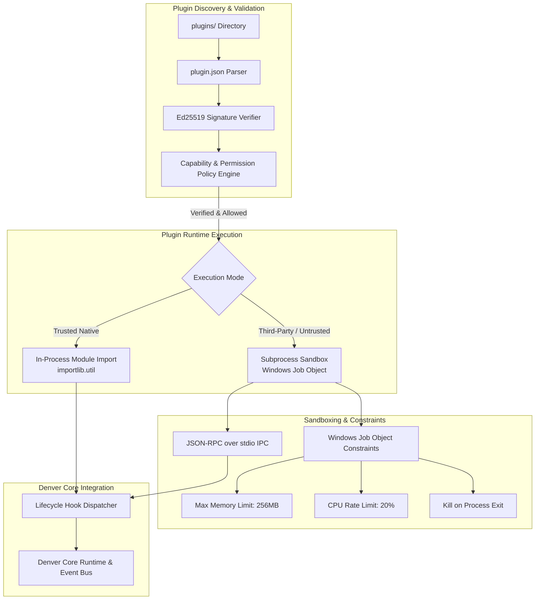

# Denver Plugin & Extension Architecture Specification

> **Product**: Denver AI Assistant (`Denver`)  
> **Objective**: Define a modular, secure, sandboxed plugin system allowing safe community extensibility without compromising user security or desktop stability.

---

## 1. High-Level Architecture



---

## 2. Plugin Manifest Contract (`plugin.json`)

Each plugin is located in its own directory (`plugins/<plugin_id>/`) and must contain a valid `plugin.json` manifest.

```json
{
  "id": "weather_radar",
  "name": "Live Weather Radar",
  "version": "1.2.0",
  "description": "Provides live local weather reports and forecasts via Open-Meteo for Denver.",
  "author": "Denver Community",
  "entrypoint": "main.py",
  "permissions": [
    "network_access",
    "system_info"
  ],
  "permission_profile": "normal",
  "signature": {
    "signer": "official_store",
    "public_key": "ed25519_pk_8f92a1...",
    "signature": "3b7c91a0f8..."
  },
  "commands": [
    {
      "trigger": "weather",
      "action": "get_weather",
      "description": "Fetch current weather and 5-day forecast"
    }
  ]
}
```

---

## 3. Capability Permission Matrix

Plugins must explicitly declare every capability they require. Capabilities are strictly bounded:

| Capability ID | Description | Default Risk Level |
|---|---|---|
| `network_access` | Allows outbound HTTP/HTTPS network requests | Low |
| `system_info` | Read-only access to CPU, RAM, battery, and OS version | Low |
| `read_clipboard` | Read access to Windows clipboard contents | Medium |
| `write_clipboard` | Write access to Windows clipboard contents | Low |
| `desktop_automation` | Ability to simulate keyboard and mouse inputs | High (Requires User Confirmation) |
| `filesystem_read` | Read files inside the plugin's own folder | Low |
| `filesystem_write` | Write files inside the plugin's own folder | Medium |
| `execute_process` | Spawn non-shell OS child processes | Critical (Blocked in Safe Mode) |

---

## 4. Lifecycle Hooks & Event Interfaces

Plugins implement standard Python lifecycle hooks:

```python
"""Example Denver Plugin Entrypoint (main.py)"""
from typing import Any

def on_load(context: Any) -> None:
    """Invoked when the plugin is initially discovered and loaded into memory."""
    context.logger.info("Weather plugin loaded into Denver Core.")

def on_enable(context: Any) -> None:
    """Invoked when the user toggles the plugin to active status."""
    context.logger.info("Weather plugin enabled.")

def on_command(command: str, context: Any) -> dict[str, Any] | None:
    """Invoked when a user command matches one of the plugin's triggers."""
    if "weather" in command:
        return {
            "status": "success",
            "response": "The current weather in London is 18°C and partly cloudy, sir.",
            "data": {"temp_c": 18, "condition": "Partly Cloudy"}
        }
    return None

def on_shutdown(context: Any) -> None:
    """Invoked during assistant graceful shutdown."""
    context.logger.info("Weather plugin cleaning up.")
```

---

## 5. Sandboxing & Windows Job Objects

To prevent untrusted third-party plugins from locking up the UI, exhausting system resources, or persisting rogue background processes:

1. **Subprocess Isolation**: Untrusted plugins execute in a separate Python child process communicating via structured JSON-RPC over `stdin`/`stdout`.
2. **Windows Job Object Enforcement**:
   - `JOB_OBJECT_LIMIT_PROCESS_MEMORY`: Hard limit (default `256 MB`).
   - `JOB_OBJECT_LIMIT_CPU_RATE`: Caps CPU usage to prevent crypto-mining or infinite loops.
   - `JOB_OBJECT_LIMIT_KILL_ON_JOB_CLOSE`: Guarantees that terminating Denver instantly terminates all child plugin processes.
3. **Restricted Environment**: Plugins run with `PYTHONNOUSERSITE=1` and an isolated temporary workspace directory.

---

## 6. Cryptographic Trust & Verification

- **Algorithm**: Ed25519 Asymmetric Signatures.
- **Trust Configuration**: `denver_plugin_trust.json`.
- **Trust Hierarchy**:
  - `official`: Signed by the core Denver project release key. Enabled by default.
  - `verified_vendor`: Signed by recognized community authors.
  - `unverified / local`: User-created scripts requiring explicit interactive user consent in the Denver Cockpit Security Center before execution.
