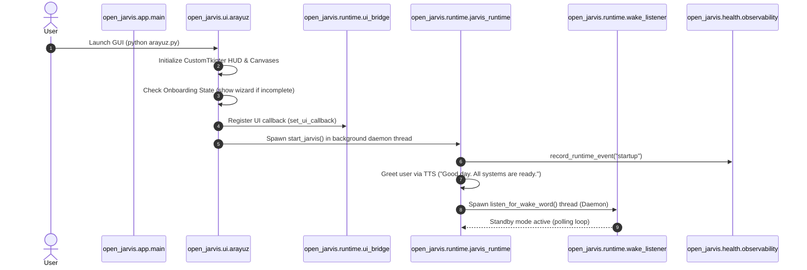
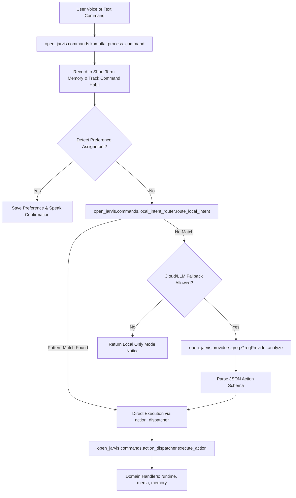

# Open.Jarvis Technical Reference Analysis

> **Notice**: This document contains an exhaustive technical study of the public reference repository `Open.Jarvis` (`https://github.com/dmrr35/Open.Jarvis`).
> This repository is evaluated strictly as a reference baseline for architectural modeling, feature extraction, and design lessons.

---

## 1. Complete Project Structure & Anatomy

```
Open.Jarvis/
├── .env.example                     # Environment template with feature flags & secrets
├── pyproject.toml                   # Python packaging, Ruff linting, Mypy configuration
├── requirements.txt                 # Core runtime dependencies
├── requirements-dev.txt             # Testing and static analysis tooling
├── jarvis.py                        # CLI / Headless entrypoint shim
├── arayuz.py                        # Desktop UI entrypoint shim (Turkish naming artifact)
├── kontrol.py                       # Diagnostics and system check CLI
├── feature_quality.py               # Feature status auditor
├── project_audit.py                 # Repository hygiene and release auditor
├── public_release.py                # Release package verification CLI
├── release_build.py                 # PyInstaller portable build wrapper
├── eval_runner.py                   # Automated evaluation runner
├── open_jarvis/                     # Primary Python package
│   ├── app/                         # Application CLI parser and bootstrap
│   ├── audio/                       # Audio I/O, Vosk STT, Edge-TTS, Wake-word matcher
│   ├── commands/                    # Intent routing, action dispatching, domain handlers
│   │   └── domains/                 # Sub-action executors (runtime, media, memory)
│   ├── config/                      # Hierarchical configuration manager, schema, paths
│   ├── evaluation/                  # Synthetic test suites, benchmark harness, latency measurements
│   ├── health/                      # Health checker, observability metrics, SLO monitors
│   ├── integrations/                # LLM fallback selector, model installer, URL validator
│   ├── memory/                      # JSON store, short-term history, preferences, habits, notes
│   ├── plugins/                     # Manifest validation, sandbox runner, signature verifier
│   ├── providers/                   # Abstract provider interface, Groq adapter, Local rule provider
│   ├── release/                     # Portable package assembler, artifact verifier, hygiene checks
│   ├── runtime/                     # Voice loop orchestrator, timer, safety guards, UI bridge
│   ├── security/                    # Command allowlisting, path confinement, admin approval policy
│   ├── ui/                          # CustomTkinter GUI, HUD canvas effects, panels, onboarding
│   └── utils/                       # Structured logging and helper shims
├── scripts/                         # Build, packaging, and CI verification scripts
├── tests/                           # Comprehensive unit and integration test suite
└── docs/                            # Markdown technical documentation and roadmaps
```

---

## 2. Startup Flow & Lifecycle



1. **GUI Initialization**: `JarvisApp` inherits from `customtkinter.CTk`. Configures dark theme, geometry (`1600x900`), and initializes the HUD canvas loops (hologram reactor, equalizer, waveform).
2. **Onboarding Check**: Evaluates `JARVIS_ONBOARDING_COMPLETE`. If missing, presents a modal wizard to calibrate the microphone and set API preferences.
3. **Daemon Runtime Spawn**: Runtime is decoupled from the UI thread via `threading.Thread(target=start_jarvis, daemon=True)`.
4. **Readiness Probe**: Emits system diagnostics (offline STT mode, memory store status, mixer readiness) via `open_jarvis.runtime.readiness`.
5. **Standby State**: The wake-word listener runs in an endless background loop while the main loop awaits state activation.

---

## 3. Runtime & Orchestration Architecture

- **Thread Segregation**:
  - UI Main Thread: Runs CustomTkinter event loop (`mainloop()`).
  - Runtime Worker Thread: Executes `jarvis_runtime.py` state machine.
  - Wake Listener Thread: Captures short audio buffers in loop.
- **Inter-Thread Communication**: Done via functional closures in `open_jarvis.runtime.ui_bridge`:
  - `send_log(message)`: Routes formatted log strings to the UI text stream.
  - `send_state(state, detail)`: Sends high-level status changes (`BOOTING`, `STANDBY`, `LISTENING`, `PROCESSING`, `EXECUTING`, `SPEAKING`, `ERROR`).
- **State Machine**:
  - Defined in `open_jarvis.audio.voice_state.VoiceStateMachine`.
  - Strictly enforces transitions (e.g. `STANDBY` -> `WAKE_WORD_DETECTED` -> `LISTENING_FOR_COMMAND` -> `PROCESSING_COMMAND` -> `EXECUTING` -> `SPEAKING_RESPONSE` -> `STANDBY`).

---

## 4. Command Processing Pipeline



1. **Input Normalization**: Removes punctuation, decomposes unicode accents, converts to lowercase ASCII.
2. **Preference Sniffing**: Regex scans for patterns like `my favorite music is synthwave` and writes directly to `memory.json`.
3. **Local Intent Pre-emption**: Deterministic rules execute in `< 2ms` without invoking AI models.
4. **AI Routing (Groq)**: Uses strict System Prompt demanding a single or multi-action JSON payload.
5. **Schema Validation**: Checks payload against `open_jarvis.commands.action_schema.validate_action_payload`.
6. **Action Dispatch**: Unrolls composite actions (`actions: [...]`), executing sequential commands with configurable inter-command delay (`JARVIS_ACTION_SEQUENCE_DELAY`).

---

## 5. Text Command System

- Implemented in `open_jarvis.commands.komutlar` and test fixtures.
- Allows direct headless invocation: `process_command("open chrome")`.
- UI features a manual text entry console in secondary dialogs for silent operation.

---

## 6. Voice Input Pipeline

- **Audio Acquisition**: PyAudio backend managed through `speech_recognition.Microphone()`.
- **Threshold Calibration**:
  - Static energy threshold default: `300` (`JARVIS_ENERGY_THRESHOLD`).
  - Dynamic energy threshold adaptation enabled in wake listener.
  - Pause threshold: `1.0s` (`JARVIS_PAUSE_THRESHOLD`).
- **Speech-to-Text Engine Selection**:
  - **Online Primary**: Google Web Speech API (`recognizer.recognize_google(audio, language="en-US")`).
  - **Offline Fallback**: Vosk (`vosk-model-small-en-us-0.15`) running Kaldi recognizer over 16kHz PCM audio buffers.

---

## 7. Wake-Word Mechanism

- **Implementation**: Text-matching over continuous low-latency STT recognition windows.
- **Audio Windowing**: Captures audio in 3-second slices (`timeout=3, phrase_time_limit=3`).
- **Matching Algorithm**: Token-based sliding window match against normalized wake phrases (`jarvis`, `hey jarvis`).
- **Cooldown Guard**: Cooldown timer (`JARVIS_WAKE_WORD_COOLDOWN_SECONDS`, default `1.0s`) prevents re-triggering during speech echo or reverberation.
- **Session Timeout**: If no follow-up command is recognized within `JARVIS_ACTIVE_TIMEOUT` (default `60s`), the session reverts to `STANDBY`.

---

## 8. Text-to-Speech (TTS) System

- **Primary Engine**: `edge-tts` (Microsoft Edge Neural Cloud TTS).
- **Voice Profile**: `en-GB-RyanNeural` (Iron Man / British butler tone), Pitch `-12Hz`, Rate `-8%`.
- **Playback Architecture**:
  - `edge_tts.Communicate.stream()` yields audio bytechunks asynchronously.
  - In-memory stream stored in `io.BytesIO`.
  - Played through `pygame.mixer.music` at `22050Hz`, 16-bit signed, mono.
- **TTS Queue**: `open_jarvis.audio.tts_queue.TTSQueue` provides a thread-safe FIFO buffer to prevent overlapping speech synthesis threads.

---

## 9. AI Provider Architecture

- **Provider Interface**: Abstract class `BaseProvider` in `open_jarvis.providers.base` with `analyze()` and `summarize()` signatures.
- **Data Transfer Objects**: `ProviderRequest` and `ProviderResponse` dataclasses holding command strings, memory context strings, metadata, and token execution envelopes.
- **Active Providers**:
  - `GroqProvider`: Uses official `groq` SDK calling `llama-3.1-8b-instant`. Features automatic rate-limit cooldown backoff (`GROQ_COOLDOWN_SECONDS = 60.0`).
  - `LocalProvider`: Wraps `local_intent_router.py` into the provider interface.

---

## 10. Local-First Behavior

- The assistant operates 100% locally if `GROQ_API_KEY` is not provided.
- Supported offline operations:
  - System telemetry (CPU, RAM, Battery, Time, Date).
  - App launching (Chrome, VS Code, Spotify, Notepad, Terminal, Office).
  - Window operations (minimize, maximize, close, lock screen).
  - Media controls (keyboard-emulated media keys or local playback shortcuts).
  - Offline Vosk transcription.
  - Local memory storage (JSON).
  - Extractive text summarization (heuristic sentence clipping without LLM).

---

## 11. Cloud AI Fallback Strategy

- Configured via `ProviderRouter` (`open_jarvis.providers.router`):
  1. Always attempts `LocalProvider.analyze(request)` first.
  2. If unsupported or unhandled, checks if `ai.cloud_fallback_enabled` is true.
  3. If allowed, injects structured context from `build_context_prompt()` into `GroqProvider`.
  4. If Groq hits rate limits or network errors, gracefully returns structured failure messages rather than crashing.

---

## 12. Desktop Automation

- Handled in `open_jarvis.commands.domains.runtime_actions`.
- Employs `pyautogui`, `psutil`, `pyperclip`, and Windows native utilities (`rundll32.exe`, `shutdown.exe`).
- Incorporates configurable execution delays (`JARVIS_ACTION_SEQUENCE_DELAY`, `JARVIS_APP_LAUNCH_DELAY`, `JARVIS_TYPE_DELAY`).

---

## 13. Application Launching

- Static lookup dictionary `APPLICATIONS` mapping app keys to candidate Windows filesystem paths across `Program Files`, `Program Files (x86)`, `LOCALAPPDATA`, and `APPDATA`.
- Fallback execution: If absolute path does not exist, executes `open_jarvis.runtime.process_runner.launch_process([app_name])` relying on Windows `PATH` resolution.

---

## 14. Browser & Web Automation

- Uses Python's standard `webbrowser.open(url)`.
- URL sanitization handled by `open_jarvis.integrations.url_safety.normalize_web_url()`:
  - Validates scheme is strictly `http` or `https`.
  - Rejects malicious protocols (`file://`, `javascript:`, `data:`, `shell:`).
- Dedicated search generator `build_google_search_url(query)` with query escaping.

---

## 15. Keyboard & Mouse Automation

- **Mouse**: `pyautogui.click(x, y, button)`, `pyautogui.doubleClick()`, `pyautogui.scroll(amount)`.
- **Keyboard**:
  - Text typing: `pyautogui.typewrite(text, interval=0.05)`
  - Key presses and combinations: `pyautogui.hotkey(*key.split("+"))` or `pyautogui.press(key)`.
  - Supported hotkeys: `ctrl+c`, `ctrl+v`, `ctrl+z`, `ctrl+s`, `alt+f4`, `win+d`, `volumeup`, `volumedown`, `volumemute`.

---

## 16. Screenshot Functionality

- Captures entire virtual desktop using `pyautogui.screenshot()`.
- Automatically generates timestamped filenames: `jarvis_YYYYMMDD_HHMMSS.png`.
- Saves directly to `%USERPROFILE%\Pictures`.
- Reveals the saved file immediately in Windows Explorer via `explorer.exe /select,<path>`.

---

## 17. Memory Architecture

```mermaid
graph TD
    subgraph Memory Store (memory.json)
        A[Preferences: music, app, volume, wake_word, custom]
        B[Habits: frequency tracking per command string]
        C[Notes: timestamped note entries max 25]
        D[Metadata: created_at, last_seen, total_commands]
    end

    subgraph Ephemeral Context
        E[Short-Term Buffer: Last 10 User & Assistant turns]
    end

    subgraph Intelligence Layers
        F[Preference Auto-Detection]
        G[Habit Ranking & Daily Summaries]
        H[Context Prompt Builder for Cloud LLM]
    end
```

- **Persistence Layer**: Plaintext JSON file (`memory.json`) in workspace or `%LOCALAPPDATA%`.
- **Bounded Storage (Pruning)**: Automatically trims notes to `MAX_NOTES = 25` and habits to `MAX_HABITS = 50` on save/load.
- **Short-Term Memory**: In-memory ring buffer (`collections.deque(maxlen=10)`) holding conversational turns.

---

## 18. Privacy Controls

- **Privacy Mode (`JARVIS_PRIVACY_MODE=true`)**:
  - Suppresses all writes to `memory.json`.
  - Treats conversation history as strictly ephemeral.
- **Sensitive Data Masking**:
  - Regex masks keys, tokens, secrets, and passwords matching `\b(KEY|TOKEN|SECRET|PASSWORD)=([^\s]+)` with `***`.
  - Strips API keys from runtime diagnostic reports and UI displays.

---

## 19. Plugin Architecture

- **Manifest Specification**: `plugin.json` containing `id`, `name`, `version`, `entrypoint`, `permissions`, and `signature`.
- **Permission Matrix**: Explicit capabilities: `desktop_automation`, `read_clipboard`, `network_access`, `filesystem_read`, `system_info`.
- **Execution Modes**:
  - In-Process: `importlib.util.spec_from_file_location` invoking lifecycle hooks (`on_load`, `on_enable`, `on_command`, `on_shutdown`).
  - Subprocess Sandbox: Executes in an isolated temporary directory with `PYTHONNOUSERSITE=1` and timeout constraints.
- **Cryptographic Trust**: Supports HMAC signatures validated against trusted signers defined in `jarvis_plugin_trust.json`.

---

## 20. Security Architecture

- **Safe Subprocess Runner (`open_jarvis.runtime.process_runner`)**:
  - Enforces argument arrays (`shell=False` only).
  - Explicitly blocks dangerous executables (`format`, `del`, `erase`, `rm`, `mkfs`).
  - Blocks shell execution flags (`cmd.exe /c`, `powershell -enc`).
- **Destructive Action Guards**:
  - `shutdown`, `restart`, `sleep` require explicit override `JARVIS_ALLOW_DESTRUCTIVE_ACTIONS=true` or user confirmation prompt.
- **Path Confinement (`open_jarvis.security.path_safety`)**:
  - Enforces that plugin and file operations remain confined within permitted directory roots using `Path.resolve().relative_to()`.

---

## 21. Configuration & Environment Variables

- **Hierarchical Resolution**:
  1. Command-line flags
  2. Operating system environment variables
  3. `.env` file via `python-dotenv`
  4. Default schema defaults in `open_jarvis.config.defaults`
- **Schema Validation**: Validates types, bounds, and string enums for 30+ settings via `open_jarvis.config.validation`.

---

## 22. Health Monitoring & Observability

- **Event Bus**: In-memory circular buffer recording structured runtime events (`startup`, `wake_word`, `command_recognized`, `app_launch_error`, etc.).
- **SLO Metrics**: Computes availability percentage, event counts, warning/error ratios.
- **Latency Snapshots**: Tracks timing histograms (p50, p95, average) across local routing, LLM network requests, and action execution.

---

## 23. Diagnostics & Self-Repair

- **Diagnostic CLI (`kontrol.py`)**:
  - Validates Python version, core dependencies, microphone availability, sound output, API keys, Vosk model path, and write permissions.
- **Health Center (`open_jarvis.health.health_center`)**:
  - Provides programmatic diagnostic checks with dry-run and apply-repair capabilities (e.g. creating missing folders, pruning bloated memory files, rotating logs).

---

## 24. UI Architecture

- Built on CustomTkinter and Tkinter Canvas.
- **Hologram Reactor HUD**: Multi-ring animated canvas rotating at variable speeds depending on assistant state.
- **Audio Waveform & Equalizer**: Canvas-drawn procedural sine wave and bar animations reacting to state activity.
- **Navigation & Cockpit Pages**:
  - Dashboard (Reactor HUD + Live Terminal Log Stream + Metrics Bar)
  - System Monitor
  - Modules
  - Integrations
  - Security Center
  - Settings Panel

---

## 25. Testing Architecture

- **Test Framework**: Standard library `unittest`.
- **Test Matrix (50+ test suites)**:
  - Action schema and dispatcher validation
  - Local intent routing accuracy
  - Groq router fallback & rate limit handling
  - Microphone failure isolation & degraded audio handling
  - Config precedence, schema, and sensitive masking
  - Plugin lifecycle, permission checks, and sandbox isolation
  - Security path safety and command safety
  - UI state and widget regression
- **CI / Eval Runner**: `eval_runner.py` runs synthetic command benchmarks checking parsing accuracy and latency budgets.

---

## 26. Dependencies & Footprint

| Package | Purpose | Necessity |
|---|---|---|
| `customtkinter` | Modern dark UI framework | Core for UI |
| `edge-tts` | Free high-quality neural voice synthesis | Core for Voice |
| `groq` | Fast Llama 3 inference provider | Optional (AI fallback) |
| `psutil` | Windows system telemetry | Core for System stats |
| `pyautogui` | Keyboard, mouse, and screenshot automation | Core for Automation |
| `pyaudio` | Audio capture from microphone | Core for STT |
| `pygame` | Low-latency audio playback for TTS | Core for TTS playback |
| `pyperclip` | Windows clipboard read/write | Core for Clipboard tools |
| `python-dotenv` | Loads `.env` configuration | Core for Config |
| `requests` | HTTP requests | Optional / Integration |
| `schedule` | Timer and recurring scheduler | Core for Timers |
| `speechrecognition` | Speech-to-text wrapper | Core for Voice |
| `spotipy` | Spotify Web API integration | Optional |
| `vosk` | Offline lightweight speech recognition | Optional (Offline STT) |

---

## 27. Entry Points

- `jarvis.py`: Headless CLI loop entrypoint.
- `arayuz.py`: CustomTkinter desktop GUI entrypoint.
- `kontrol.py`: System diagnostic and pre-flight check CLI.
- `eval_runner.py`: Performance and accuracy benchmark runner.
- `scripts/build_windows_portable.py`: PyInstaller packaging script.

---

## 28. Release & Build Process

- Uses PyInstaller (`pyinstaller --onedir --windowed arayuz.py`).
- Packaging script `open_jarvis.release.windows_portable` copies executable artifacts, license, `.env.example`, docs, and optional folders into a portable folder structure.
- Creates `.zip` archive and computes SHA-256 checksums.
- Verifies package integrity via `open_jarvis.release.artifact_verifier`.

---

## 29. Existing Limitations & Anti-Patterns in Reference

1. **Monolithic UI Threading**: The Tkinter canvas draws every frame via `after()` ticks in the main thread. High CPU usage or complex canvas rendering can stutter the UI.
2. **Text-Matching Wake-Word**: SpeechRecognition is constantly invoked in 3-second slices. This is inefficient compared to streaming acoustic wake-word engines like Porcupine, openWakeWord, or ONNX-based acoustic models.
3. **Flat JSON Storage**: `memory.json` lacks transactional safety, concurrency locks, indexing, and vector similarity search.
4. **PyAutoGUI Coordinate Fragility**: UI automation relies on hardcoded pixel coordinates and keystrokes without accessibility tree (UI Automation / UIA) awareness.
5. **Simulated Sandbox**: Plugin sandbox uses a temporary directory with `PYTHONNOUSERSITE=1`, which does not provide true kernel-level OS process confinement on Windows (AppContainer / Windows Sandbox / Job Objects).
6. **Legacy Code Artifacts**: Mixed Turkish and English naming (`arayuz.py`, `kontrol.py`, `ses_motoru.py`, `komutlar.py`, `haftalik_guncelleme.py`).

---

## 30. Planned vs Implemented Features Inventory

See `docs/FEATURE_MATRIX.md` for the exhaustive inventory and breakdown.
