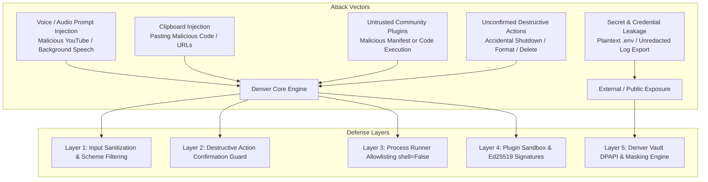

# Denver Security Architecture & Threat Model

> **Product**: Denver AI Assistant (`Denver`)  
> **Objective**: Define a defense-in-depth security architecture protecting the user's desktop, private data, credentials, and system stability from local and remote attack vectors.

---

## 1. Threat Model & Attack Vectors



---

## 2. Security Defense Layers

### Layer 1: Input Sanitization & Protocol Allowlisting
- **URL Sanitization**:
  - Rejects any URL scheme that is not explicitly `http://` or `https://`.
  - Blocks dangerous pseudo-protocols (`file://`, `javascript:`, `data:`, `ms-settings:`, `shell:`).
  - Sanitizes query strings before passing to default browser.
- **Clipboard Content Guard**:
  - Automatically suppresses direct shell evaluation of copied clipboard text.
  - Summaries and voice reads are filtered through regex masks to prevent reading API keys, auth tokens, or private secrets aloud.

### Layer 2: Destructive Action & Confirmation Guard
- **Guarded System Actions**: `shutdown`, `restart`, `sleep`, `format`, `erase`, `kill_process`.
- **Confirmation Flow**:
  1. Assistant pauses execution.
  2. UI displays an interactive high-priority confirmation dialog with a 10-second auto-abort countdown.
  3. TTS prompts: *"Sir, you have requested a system shutdown. Please confirm within 10 seconds."*
  4. Requires explicit voice confirmation (`"yes confirm"`) or UI click to proceed.

### Layer 3: Safe Subprocess Execution Engine
- **No Shell Execution**: All subprocess invocations use strict argument lists with `shell=False`.
- **Dangerous Binary Blacklist**: Explicitly blocks execution of:
  - `del`, `erase`, `rm`, `format`, `mkfs`, `diskpart`, `vssadmin`.
- **Shell Flag Interception**: Blocks arguments containing shell execution flags:
  - `cmd.exe /c`, `powershell.exe -enc`, `bash -c`.

### Layer 4: Path Confinement & Traversal Protection
- All file reads, writes, and plugin executions are resolved using `pathlib.Path.resolve()`.
- Verifies that `resolved_path.relative_to(allowed_root)` does not throw `ValueError`.
- Prevents directory traversal attacks (`../../Windows/System32`).

### Layer 5: Denver Vault (Windows DPAPI Encrypted Credential Storage)
- Replaces plaintext storage in `.env` with encrypted storage backed by the **Windows Data Protection API (DPAPI)** or Python's `keyring` module.
- Secrets are tied to the active Windows user login session and cannot be extracted by unauthorized users or copied to another machine.

### Layer 6: Privacy Mode & Sensitive Data Redaction
- **Regex Redaction Engine**: Automatically masks matches for sensitive keys in logs, audit records, and UI displays:
  ```regex
  \b([A-Z0-9_]*(?:KEY|TOKEN|SECRET|PASSWORD|AUTH)[A-Z0-9_]*)=([^\s]+)
  ```
- **Privacy Mode Toggle (`DENVER_PRIVACY_MODE=true`)**:
  - Disables all persistent writes to SQLite database.
  - Memory buffers stay strictly in RAM and are zeroized upon application exit.

---

## 3. Permission Profiles

Denver operates under three user-selectable security profiles:

| Profile | Destructive Actions | Clipboard Access | Plugin Execution | Cloud LLM Fallback |
|---|---|---|---|---|
| **Safe Mode** | Blocked completely | Read-only with strict masking | Signed official plugins only | Disabled (100% Local) |
| **Normal Mode (Default)** | Requires interactive confirmation | Enabled with secret masking | Official & verified plugins | Enabled with user consent |
| **Developer Mode** | User confirmation configurable | Full access | Unsigned local plugins allowed | Enabled |
