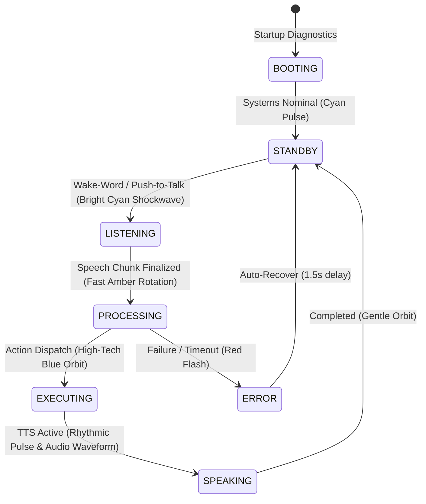

# Denver User Interface & Visual HUD Architecture

> **Product**: Denver AI Assistant (`Denver`)  
> **Objective**: Define a state-of-the-art, high-performance, dark-mode cyber HUD desktop interface (Denver Cockpit) with rich dynamic visualizers.

---

## 1. Visual Design System & Aesthetic Language

### Palette Specification
- **Deep Space Background**: `#030712` (95% pitch dark navy-black)
- **Glassmorphic Surface**: `#081325` (translucent cyber slate)
- **Denver Cyan (Primary Reactor Glow)**: `#00f3ff`
- **Core Blue (Secondary Accent)**: `#0077ff`
- **Operational Green**: `#00ff88`
- **Warning Amber**: `#ffaa00`
- **Critical Red**: `#ff3355`
- **Cockpit Lines & Grid**: `#112a45`
- **Muted Telemetry Text**: `#567a9c`
- **Crisp Value Text**: `#e0f7ff`

### Typography
- **Display / Headers**: *Orbitron* / *Outfit* / *Segoe UI Variable Display* (Bold uppercase letter-spaced)
- **Telemetry & Logs**: *JetBrains Mono* / *Consolas* / *Cascadia Code*
- **Interface Labels**: *Segoe UI Variable Text* / *Inter*

---

## 2. Desktop Cockpit Layout Structure

```
+----------------------------------------------------------------------------------------------------+
|  [O] DENVER CYBER INTERFACE                       [ MONDAY 14 SEP 2026 ]             [-] [[]] [X] |
+----------------------------------------------------------------------------------------------------+
| [NAV] |                                                                                            |
|   *   |                                    /‾‾‾‾‾‾‾‾‾‾‾\                                           |
| Dash  |                                   |  ( ( @ ) )  |   <-- Multi-Ring Hologram Reactor        |
|  Sys  |                                    \___________/                                           |
|  Mod  |                                                                                            |
|  Int  |                                    D . E . N . V . E . R                                   |
|  Sec  |                         "All systems nominal. Awaiting command, sir."                      |
|  Set  |                                                                                            |
|       |   +-------------------------------------------------------------+ +--------------------+   |
|       |   | > [STARTUP] Denver Core online. Microphone ready            | | |||||||||||||||||| |   |
|       |   | > [VOICE] Listening for wake-word "Denver"                  | | Equalizer Spectrum |   |
|       |   | > [OK] Live telemetry stream active                         | | (Real-Time Audio)  |   |
|       |   +-------------------------------------------------------------+ +--------------------+   |
+----------------------------------------------------------------------------------------------------+
| SYS: ONLINE | TIME: 11:35:57 | CPU: 12% | RAM: 38% | GPU: 14% | ~~~ Waveform ~~~ | PRIVACY: SAFE     |
+----------------------------------------------------------------------------------------------------+
```

---

## 3. Dynamic Visualizer Components

### 3.1. Hologram Arc Reactor HUD
- **Canvas Rendering**: Multi-layered concentric rotating geometric rings.
- **Dynamic Speed Modulation**:
  - `STANDBY`: Gentle slow rotation (`0.02 rad/frame`), subtle pulse glow.
  - `LISTENING`: Expanding outer rings, responsive blue/cyan brightness.
  - `PROCESSING`: Rapid counter-rotating dual-rings (`0.12 rad/frame`), glowing core amber/cyan.
  - `SPEAKING`: Rhythmic expanding shockwaves synchronized to audio output.
  - `ERROR`: Warning amber/red core flash with glitch displacement.

### 3.2. Real-Time Audio Equalizer & Waveform
- **Frequency Spectrum (FFT)**: 16-band vertical bar visualizer reacting directly to microphone input when listening and TTS stream when speaking.
- **Procedural Sine Waveform**: Multi-harmonic sine generator with variable amplitude, phase shift, and cyber grid background.

---

## 4. State-Driven Color & Motion Profiles



| State Name | Accent Color | Reactor Speed | Subtitle Text | Audio Visualizer Activity |
|---|---|---|---|---|
| `BOOTING` | `#0077ff` | Medium | "Initializing Denver core neural subsystems..." | Inactive |
| `STANDBY` | `#00f3ff` | Slow (1.0x) | "Standing by — say 'Denver' to activate" | Idle low ripple |
| `LISTENING` | `#00f3ff` | Fast (2.5x) | "Listening for your command, sir..." | Microphone live FFT |
| `PROCESSING` | `#ffaa00` | Rapid (4.0x) | "Routing intent and analyzing action plan..."| Animated pulse |
| `EXECUTING` | `#00ff88` | Fast (2.0x) | "Executing desktop automation..." | High activity |
| `SPEAKING` | `#00f3ff` | Dynamic (3.0x) | "Speaking response..." | TTS audio waveform |
| `ERROR` | `#ff3355` | Strobe | "System encountered an execution fault" | Glitch freeze |

---

## 5. Navigation & Cockpit Pages

1. **Dashboard**: Live Arc Reactor, Command Log Stream, Telemetry Footbar, Quick Commands.
2. **System Monitor**: Real-time graphs for CPU, GPU, RAM, Disk I/O, Network Latency, and Audio Device health.
3. **Modules / Actions**: Interactive catalog of available automations, app shortcuts, and custom macros.
4. **Integrations**: Live connection status for Groq, Gemini, Ollama, Spotify, Weather, and Webhook bridges.
5. **Security Center**: Active permission profile toggle, masked secret inspector, audit log viewer, and plugin trust manager.
6. **Settings Panel**: Audio device selector, wake-word sensitivity slider, TTS voice chooser, and startup toggle.

---

## 6. Floating Denver Spotlight Quick-Bar Overlay

- **Global Shortcut**: `Ctrl + Shift + J` or `Win + Space`.
- **Behavior**: Summons a lightweight, borderless, floating glassmorphic search bar centered on the active screen.
- **Functionality**:
  - Instant text command entry with auto-complete suggestions.
  - Live voice transcription indicator.
  - Quick action preview before execution.
  - Automatically hides upon command dispatch or pressing `Escape`.
