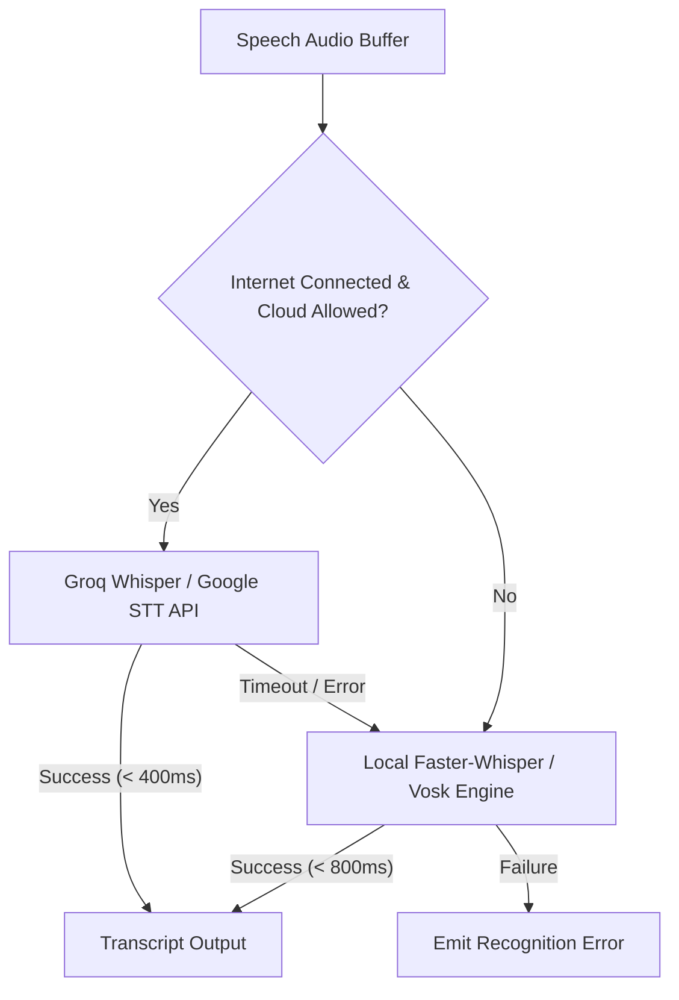

# Denver Voice Processing Pipeline Specification

> **Product**: Denver AI Assistant (`Denver`)  
> **Objective**: Define a low-latency, resilient, dual-engine (offline/online) voice processing pipeline for hands-free and push-to-talk interactions.

---

## 1. End-to-End Voice Architecture

```mermaid
graph TD
    subgraph Audio Capture & Ingestion
        Mic[Microphone Hardware / WASAPI] --> Stream[16kHz Mono 16-bit PCM Stream]
        Stream --> Buffer[Ring Audio Buffer]
    end

    subgraph Stage 1: Wake-Word & VAD
        Buffer --> WakeCheck{Mode?}
        WakeCheck -- Hands-Free --> WakeEngine[Streaming Acoustic Wake Engine<br/>openWakeWord / ONNX (Planned: Denver)]
        WakeCheck -- Push-to-Talk --> Hotkey[Global Hotkey Trigger]
        WakeEngine -- Wake Detected --> VAD[Silero Voice Activity Detector]
        Hotkey --> VAD
    end

    subgraph Stage 2: Speech-to-Text (STT)
        VAD -- Speech Chunk Completed --> STTRouter{STT Selector}
        STTRouter -- Local / Offline --> LocalSTT[Faster-Whisper / Vosk Engine]
        STTRouter -- Cloud / Fast --> CloudSTT[Groq Whisper / Google STT]
        LocalSTT --> Transcript[Normalized Text Transcript]
        CloudSTT --> Transcript
    end

    subgraph Stage 3: Denver Core & Dispatch
        Transcript --> Core[Denver Core Brain]
        Core --> RespText[Denver Text Response]
    end

    subgraph Stage 4: Text-to-Speech (TTS)
        RespText --> TTSRouter{TTS Selector}
        TTSRouter -- Online Neural --> EdgeTTS[Microsoft Edge Neural Cloud TTS]
        TTSRouter -- Offline Neural --> PiperTTS[Piper Local Neural TTS]
        EdgeTTS --> StreamQueue[TTS Audio Stream Queue]
        PiperTTS --> StreamQueue
    end

    subgraph Audio Playback & Barge-In
        StreamQueue --> Mixer[Pygame / PyAudio Mixer Playback]
        Mixer --> Speaker[Audio Output Device]
        VAD -. User Speaks (Barge-In) .-> MixerStop[Halt Current TTS Playback]
    end
```

---

## 2. Audio Capture & Hardware Layer

- **Sampling Parameters**: `16,000 Hz` sample rate, `16-bit` signed integer PCM, `Mono` channel.
- **Driver Model**: Windows Audio Session API (WASAPI) or DirectSound via PyAudio/SoundDevice.
- **Latency Budget**: `50ms` buffer chunks (`800` samples per frame).
- **Auto-Calibration**: Measures ambient noise floor (RMS power) on startup and calculates dynamic energy thresholds to handle background fans, air conditioning, and room reverberation.

---

## 3. Wake-Word Engine

### Comparison: Reference vs Denver

| Parameter             | Reference Architecture (`Open.Jarvis`)            | Denver Target Architecture                                   |
| --------------------- | ------------------------------------------------- | ------------------------------------------------------------ |
| **Mechanism**         | 3-second audio slices passed to full STT engine   | Continuous frame-by-frame acoustic neural embedding matching |
| **Engine**            | SpeechRecognition + Google / Vosk string matching | openWakeWord / ONNX acoustic runtime                         |
| **Latency**           | 1,500ms – 3,500ms per check                       | **< 100ms**                                                  |
| **CPU Usage**         | High (constant transcription cycles)              | **< 1% on modern CPU**                                       |
| **Privacy**           | Audio constantly transcribed                      | Zero transcription until wake model triggers                 |
| **Supported Phrases** | Hardcoded text checks                             | Configurable trained models (`Denver`, `Hey Denver`)         |

### Cooldown & False-Positive Suppression

- Implements a monotonic debounce timer (`DENVER_WAKE_WORD_COOLDOWN_SECONDS = 1.0s`).
- Rejects wake triggers during active speech output unless barge-in threshold is met.

---

## 4. Voice Activity Detection (VAD)

- **Engine**: Silero VAD (ONNX runtime).
- **Functionality**:
  - Distinguishes human speech from keyboard clicks, breathing, and ambient noise with `> 99%` accuracy.
  - Dynamically detects the exact start and end of user speech utterances.
  - Automatically finalizes the speech chunk after `600ms` of post-speech silence (eliminating fixed 10-second wait timeouts).

---

## 5. Speech-to-Text (STT) Subsystem

### Dual-Engine Strategy



1. **Local Offline Engine**:
   - **Vosk**: Extremely lightweight (`~50MB`), instant startup, low memory (`< 150MB`).
   - **Faster-Whisper (tiny.en / base.en)**: High accuracy, handles accents, runs on CPU/GPU via CTranslate2.
2. **Cloud High-Speed Engine**:
   - **Groq Whisper Large-v3**: Cloud processing speed of `~200ms` for full sentences.
   - **Google Web Speech**: Free default fallback.

---

## 6. Text-to-Speech (TTS) Subsystem

### Dual-Engine Strategy

1. **Online Primary: Microsoft Edge Neural TTS**
   - **Voice**: `en-GB-RyanNeural` (British, formal, dignified butler aesthetic).
   - **Parameters**: Pitch `-12Hz`, Rate `-8%`.
   - **Streaming Playback**: Asynchronous chunk streaming via `edge_tts.Communicate.stream()`. Audio bytes stream into an in-memory buffer and begin playback before full synthesis completes.
2. **Offline Secondary: Piper Local Neural TTS**
   - **Engine**: ONNX neural acoustic model running fully locally.
   - **Voice**: `en_GB-alan-medium` or `en_US-lessac-medium`.
   - **Latency**: `< 100ms` to first audio buffer on CPU. Zero network dependency.

---

## 7. Speech Interruption & Barge-In Support

- When Denver is speaking through the audio mixer, the microphone capture stream remains active.
- If Silero VAD detects sustained user speech with high confidence (`> 0.85` probability for `> 300ms`), the runtime triggers a **Barge-In Event**.
- The mixer immediately halts current audio playback, clears the TTS queue, and switches the state machine to `LISTENING_FOR_COMMAND`.

---

## 8. State Machine Integration

```
[STANDBY]
   │ (Acoustic Wake-Word "Denver" or Push-to-Talk)
   ▼
[WAKE_DETECTED]
   │ (Play subtle audio chime)
   ▼
[LISTENING] ──(Silero VAD Speech Buffer)──► [PROCESSING]
   ▲                                              │ (Route & Dispatch)
   │                                              ▼
   └──(Barge-In Speech Detected)─────── [SPEAKING]
```
